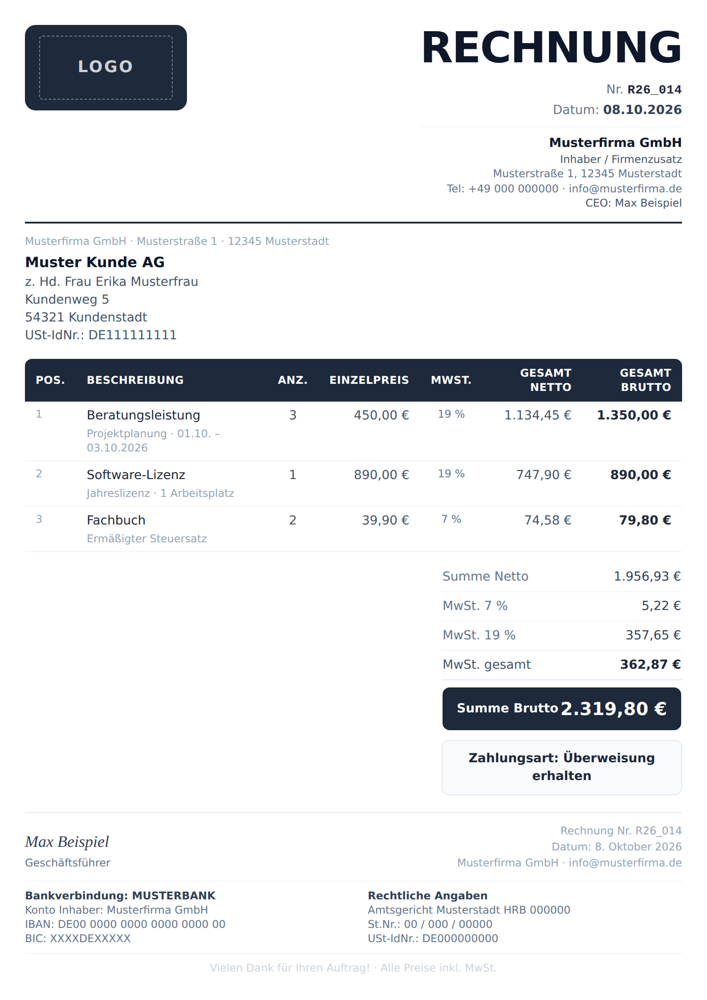
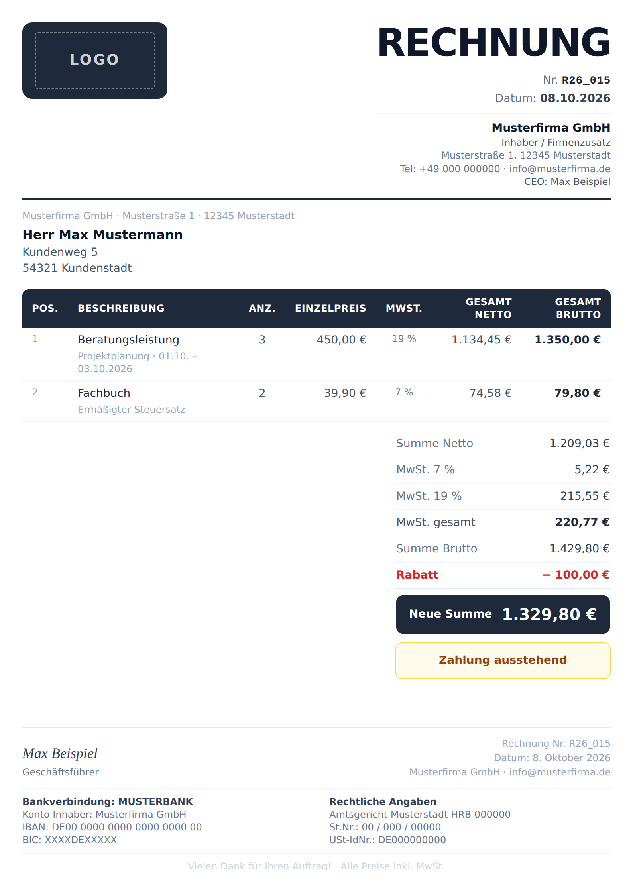
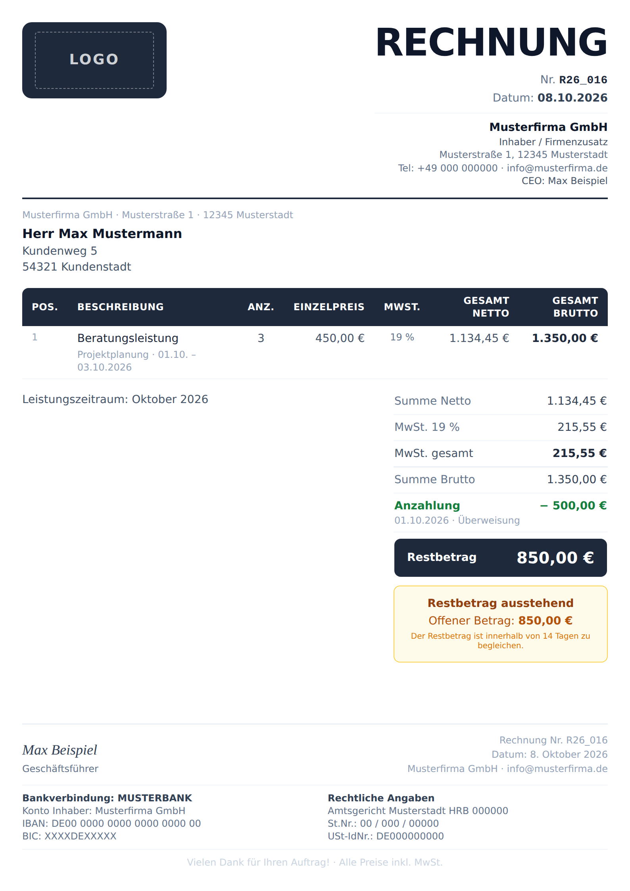
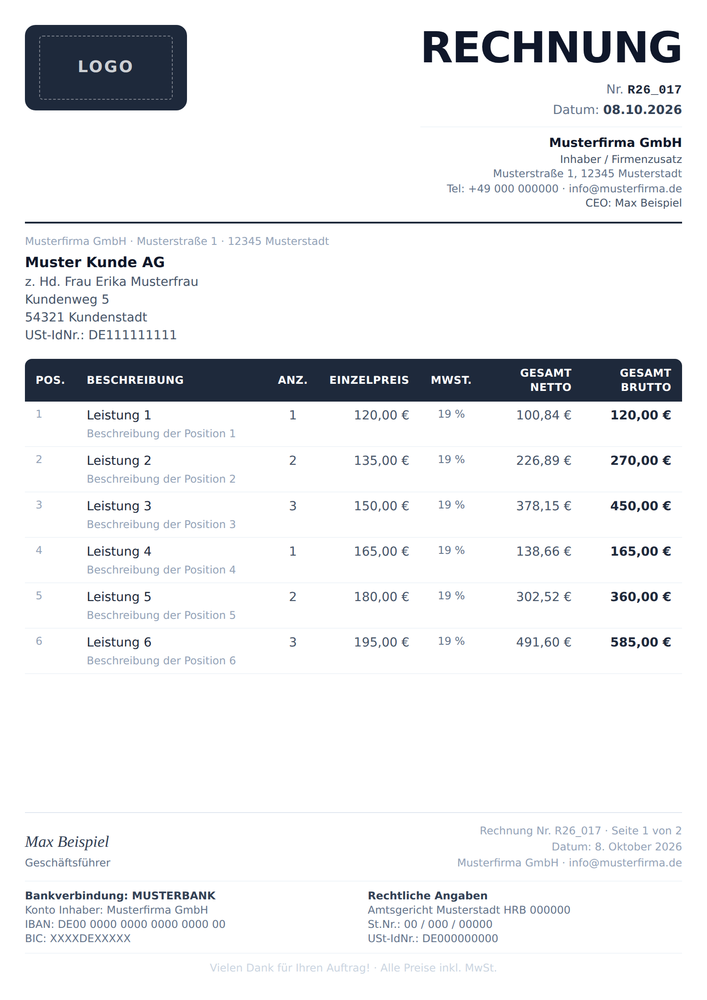
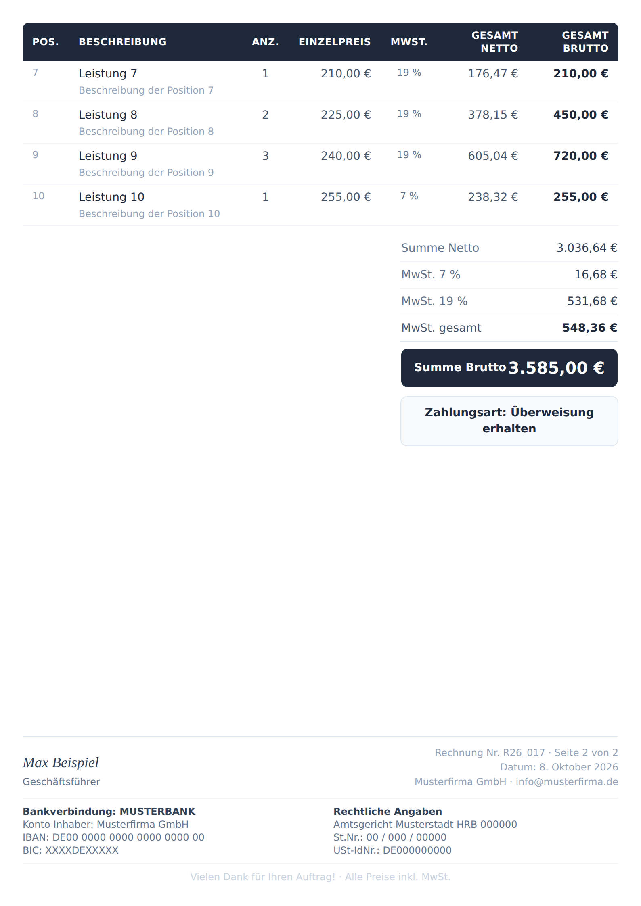
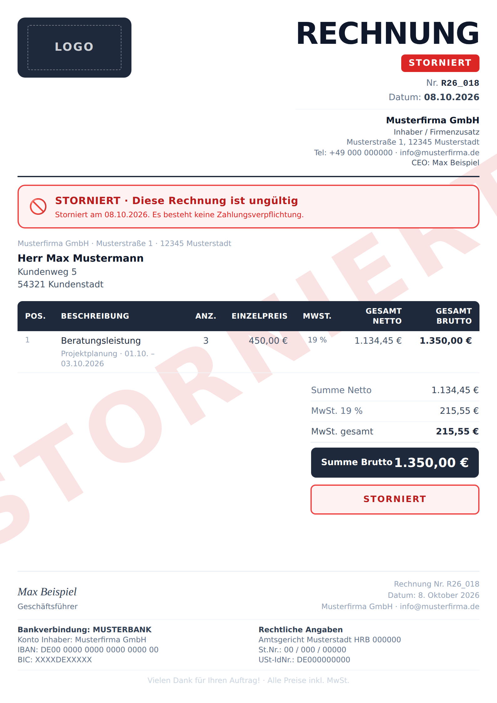

# Fatura Sistemi — Başka Bir Programa Taşıma Rehberi

Bu dosya, otel rezervasyon programında kullandığımız fatura sistemini **başka (otelle ilgisi olmayan) bir programa** taşımak için yazıldı.

**Asıl amaç: faturanın tasarımını birebir kopyalamak.** Hesaplama ve iş kuralları da aşağıda anlatılıyor, ama yeni programda öncelik görünümün aynı olması.

> **Dahil edilmeyenler**
> - Otele özel her şey: oda satırları, kahvaltı satırı ve kahvaltının oda fiyatından düşülmesi, grup / aile rezervasyonları, check-in / check-out saatleri, "Vorzeitige Abreise", rezervasyondan otomatik fatura.
> - Şirkete özel bilgiler: şirket adı, adres, telefon, e-posta, IBAN, BIC, banka, vergi numarası, USt-IdNr., Handelsregister, imza sahibi, logo. Ekran görüntülerinde bunların yerine **yer tutucu** (Musterfirma, `DE00 0000 …`) kullanıldı. Yeni programda bunlar ayarlardan gelmeli.

Ekran görüntüleri: [`fatura_sistemi_ss/`](fatura_sistemi_ss/)

---

## 1. ⚠️ Önemli: Yeni programda PDF **vektör** olarak üretilmeli

Mevcut programda PDF, ekranda çizilen HTML'in **fotoğrafı çekilerek** oluşturuluyor (`html2canvas` + `jsPDF`, `src/lib/pdfCapture.ts`). Bunun sorunları:

- Yazılar piksel. Yakınlaştırınca hafif bulanık görünüyor (çözünürlüğü 3× yaparak azalttık ama tamamen geçmiyor).
- Dosya büyük (sayfa başına yüzlerce KB).
- Metin seçilemiyor ve aranamıyor.
- Logo gibi şeffaf görseller için ayrıca hack gerekiyor.

Bunu çözmek için `claude/vector-invoice-pdf` adında bir test branch'i açılmıştı, ama **devam edilmedi** (main'e alınmadı). **Yeni programda fatura baştan vektör olarak kurulacak.** O branch'teki yaklaşım referans alınabilir:

| Konu | Branch'teki çözüm |
|---|---|
| Kütüphane | `@react-pdf/renderer` (4.x), sunucu tarafında (API route) PDF üretir |
| Dosyalar | `src/lib/invoicePdfDoc.tsx` (layout), `src/lib/invoiceMath.ts` (tüm hesaplar), `src/app/api/invoices/[id]/pdf/route.ts` |
| Fontlar | Liberation Sans (Regular/Bold) + Liberation Serif Italic (imza için), TTF olarak gömülü (SIL OFL lisansı). Yerleşik Helvetica Türkçe ğ ş ı İ karakterlerini desteklemiyor, bu yüzden font gömmek şart |
| Ölçüler | HTML tasarımı 794 px genişlik (A4 @ 96 dpi). PDF'te `pt = px × 0.75` (A4 = 595.28 pt). Böylece oranlar birebir korunuyor |
| Footer | `fixed` özelliği ile her sayfada tekrar ediyor; sayfa `paddingBottom` ile footer'a yer ayırıyor |
| Sayfalama | Otomatik: satırlar sığmayınca sonraki sayfaya akıyor |
| Sonuç | ~60 KB, keskin, metin seçilebilir/aranabilir |
| Deploy notu | Next.js'te font dosyalarının serverless pakete girmesi için `outputFileTracingIncludes` gerekiyor. Next 14.2'de bu ayar `experimental` altında olmalı. Branch'teki Vercel build'i bu yüzden uyarı verdi |

**Önerilen mimari (yeni program):**
1. Tüm hesaplar **tek bir saf fonksiyonda** (`invoiceMath(invoice) → { satırlar, netto, mwst7, mwst19, ... }`). Ekrandaki önizleme ve PDF aynı fonksiyonu kullanır, sayılar asla farklı çıkmaz.
2. PDF sunucuda vektör olarak üretilir. "Drucken", "PDF speichern" ve "E-posta eki" hepsi bu aynı PDF'i kullanır.
3. Ekran önizlemesi isteğe bağlı olarak HTML olabilir (aşağıdaki tasarımla), ama son çıktı her zaman vektör PDF.

---

## 2. Tasarım (birebir kopyalanacak kısım)

Hazır referans: [`fatura_sistemi_ss/vorlage_referenz.html`](fatura_sistemi_ss/vorlage_referenz.html). Tarayıcıda açılabilir, CSS gömülü (Tailwind derlenmiş). Ölçüler ve renkler bu dosyada birebir var.

### 2.1 Sayfa
- A4 dikey. Ekranda **794 × 1123 px**, iç boşluk **28 px** (baskıda 9 mm).
- Arka plan beyaz. Ekranda sayfa gri zemin (`#e2e8f0`) üstünde gölgeli kağıt gibi duruyor, sayfalar arasında 24 px boşluk var.
- Sayfa dikey flex: içerik üstte, **footer her zaman sayfanın en altında** (aradaki boşluk `flex: 1` ile doluyor).
- Font: sistem sans-serif (Tailwind varsayılanı). İmza: `Georgia, serif` italik.

### 2.2 Renk paleti (Tailwind slate)
| Kullanım | Renk |
|---|---|
| Koyu ana renk (logo kutusu, tablo başlığı, toplam kutusu, ayırıcı çizgi) | `#1e293b` (slate-800) |
| Başlık "RECHNUNG", kalın metin | `#0f172a` (slate-900) |
| Normal metin | `#475569` / `#334155` (slate-600/700) |
| İkincil metin | `#64748b` (slate-500) |
| Soluk metin (açıklama, Pos. no, footer sağ) | `#94a3b8` (slate-400) |
| İnce çizgiler | `#f1f5f9` / `#e2e8f0` (slate-100/200) |
| Ödeme satırı (yeşil) | `#15803d`. Tam ödendi kutusu: zemin `#f0fdf4`, kenar `#86efac` |
| Bekleyen ödeme kutusu (amber) | zemin `#fffbeb`, kenar `#fcd34d`, metin `#92400e` / `#b45309` |
| Rabatt / Storno (kırmızı) | `#dc2626`, kutu zemini `#fef2f2`, kenar `#ef4444` |

### 2.3 Bölümler (yukarıdan aşağıya)

**1. Başlık (sadece 1. sayfada)**
- Sol: logo, `slate-800` zeminli, köşeleri yuvarlak (12 px) bir kutunun içinde (logo 150×72 px, kutu iç boşluğu 16/12 px). Logo beyaz/şeffaf olduğu için koyu kutu şart.
- Sağ, sağa yaslı:
  - **RECHNUNG**: 48 px, `font-weight: 900`, sıkı harf aralığı.
  - (Storno ise kırmızı "STORNIERT" etiketi)
  - `Nr. R26_014`: numara monospace ve kalın.
  - `Datum: 08.10.2026`
  - İnce çizgi, ardından firma bloğu (12 px): firma adı kalın 14 px, alt satırlar adres / tel · e-posta / CEO.
- Altında tam genişlikte **2 px koyu çizgi** (`slate-800`).

**2. Alıcı adresi (sadece 1. sayfada)**
- En üstte küçük soluk satır: gönderen firma tek satırda (`Firma · Straße · PLZ Ort`). Pencereli zarf stili.
- Alıcı adı kalın, altında adres satırları (14 px).
- Firma adına kesilen faturada üç seçenek var (bkz. 3.4).

**3. Kalem tablosu**
- Başlık satırı `slate-800` zemin, beyaz, 12 px, BÜYÜK HARF, letter-spacing. Sol üst ve sağ üst köşeler yuvarlak.
- Sütunlar: `Pos.` | `Beschreibung` | `Anz.` (orta) | `Einzelpreis` (sağ) | `MwSt.` (orta, küçük) | `Gesamt Netto` (sağ) | `Gesamt Brutto` (sağ, **kalın**).
- Her satır: başlık 14 px medium, altında açıklama 12 px soluk (`slate-400`). Satırlar arasında ince `slate-100` çizgi.
- **En fazla 6 kalem bir sayfaya** sığdırılıyor; 7. kalemden itibaren yeni sayfa açılıyor. 2. ve sonraki sayfalarda başlık ve adres **tekrar edilmiyor**, tablo başlığı tekrar ediliyor ve numaralar devam ediyor (7, 8, 9…).
- ⚠️ Sabit "6 kalem" sınırı her durumda güvenli değil. Uzun alıcı adresi, çok satırlı açıklamalar, indirim ve ödeme satırları birleşince 3 kalemde bile sayfa A4'ü aşabiliyor (ekran görüntüleri hazırlanırken görüldü). Yeni programda vektör PDF'in **otomatik akışı** kullanılmalı: satır sığmıyorsa sonraki sayfaya geçsin, toplam bloğu bölünmesin (`wrap={false}`).

**4. Toplamlar (sadece son sayfada, sağda 270 px genişlik)**
Sol tarafta varsa fatura notu yer alıyor. Sağ tablo, sırasıyla:
1. `Summe Netto`
2. `MwSt. 7 %` (sadece 7 %'lik kalem varsa)
3. `MwSt. 19 %` (sadece 19 %'lik kalem varsa)
4. `MwSt. gesamt` (kalın)
5. İndirim varsa: `Summe Brutto` ve ardından kırmızı `Rabatt − 100,00 €`
6. Ödeme varsa: (indirim yoksa `Summe Brutto`), ardından **her ödeme ayrı satır**: yeşil "Anzahlung" / "Zahlung", altında küçük "tarih · yöntem", sağda `− tutar`. İade (Erstattung) kırmızı ve `+`.
7. **Koyu toplam kutusu** (`slate-800`, yuvarlak): sol etiket, sağda 20 px `font-weight: 900` tutar. Etiket:
   - ödeme varsa → `Restbetrag`
   - indirim var, ödeme yok → `Neue Summe`
   - diğer → `Summe Brutto`
8. **Durum kutusu** (toplamın altında):
   - Storno → kırmızı çerçeve, "STORNIERT"
   - Tamamı ödendi → yeşil, "Vollständig bezahlt / Der Gesamtbetrag ist vollständig ausgeglichen."
   - Kısmi ödeme → amber, "Restbetrag ausstehend", "Offener Betrag: X €" ve ödeme vadesi metni
   - Hiç ödeme yok, ödenmedi → amber, **sadece** "Zahlung ausstehend" (başka metin yok)
   - Ödendi, yöntem belli → gri kutu, "Zahlungsart: Überweisung erhalten"

**5. Footer (her sayfada, en altta)**
- Üstte ince çizgi.
- Sol: imza sahibinin adı (Georgia italik, 18 px), altında unvan.
- Sağ, soluk: `Rechnung Nr. R26_017 · Seite 2 von 2` (sayfa numarası sadece birden fazla sayfa varsa), `Datum: 8. Oktober 2026`, `Firma · e-posta`.
- İki sütun (12 px): sol **Bankverbindung** (banka, Konto Inhaber, IBAN, BIC), sağ **Rechtliche Angaben** (Register, St.Nr., USt-IdNr.).
- En altta ortalı, çok soluk: "Vielen Dank für Ihren Auftrag! · Alle Preise inkl. MwSt."

**6. Storno görünümü**
- Sayfanın ortasında −32° döndürülmüş dev "STORNIERT" filigranı (150 px, `rgba(220,38,38,0.13)`).
- Başlıkta kırmızı etiket, adresin üstünde kırmızı uyarı bandı ("Diese Rechnung ist ungültig · Storniert am … Es besteht keine Zahlungsverpflichtung."), durum kutusu kırmızı.

---

## 3. İş kuralları (genel, otelden bağımsız)

### 3.1 Fiyatlar brüt girilir
Kalem fiyatları **KDV dahil (brüt)** saklanıyor. Net değerler hesaplanıyor:

```
satır_brüt = adet × birim_fiyat
satır_net  = satır_brüt / (1 + oran/100)
mwst7      = Σ(7 %'lik satırların brüt − net)
mwst19     = Σ(19 %'lik satırların brüt − net)
summe_netto  = Σ net
summe_brutto = Σ brüt
neue_summe   = summe_brutto − rabatt
restbetrag   = max(0, neue_summe − Σ ödemeler (iadeler eksi))
```
Para her zaman kuruşa yuvarlanır (`Math.round((n + EPSILON) * 100) / 100`). Gösterim `de-DE`, örneğin `1.234,50 €`. Tutar ile € arasında **bölünmez boşluk** (U+00A0) kullanılıyor ki € alt satıra kaymasın.

### 3.2 Kalem modeli
```ts
interface LineItem {
  id: string
  name: string          // kalın başlık
  description?: string  // altındaki soluk satır
  qty: number
  unit_price: number    // brüt
  vat_rate: 7 | 19
}
```

### 3.3 Fatura numarası
Format `R{yy}_{nnn}`, örneğin `R26_014`. Numara her zaman bir sonraki boş numara olarak, sıralı veriliyor. Numara sunucu/DB tarafında atomik olarak alınmalı (çakışma olmasın).

### 3.4 Alıcı seçimi (Kunde / Firma / Firma ohne Namen)
- **Kunde**: kişinin adı ve adresi.
- **Firma**: firma adı, altında "z. Hd. Frau/Herr Ad Soyad", ardından firma adresi ve USt-IdNr.
- **Firma ohne Namen**: sadece firma adı, adresi ve USt-IdNr. (kişi adı yok).

Hitap (Herr/Frau) ayrı bir alanda tutuluyor.

### 3.5 Kesilmiş fatura asla değişmez ⚠️
En önemli kural: **kesilmiş bir fatura sonradan değişen ayarlardan etkilenmemeli.**
- Fatura oluşturulurken o anki **footer bilgileri** (banka, IBAN, BIC, register, vergi no, USt-IdNr., imza sahibi, unvan) faturanın kendi satırına **JSON kopya** olarak yazılıyor (`invoices.footer`). Fatura her zaman kendi kopyasıyla çiziliyor. Ayarlar değişince sadece yeni faturalar etkileniyor.
- Aynı mantık KDV oranı gibi değerler için de geçerli: oran faturaya yazılıyor, koddan okunmuyor.
- Müşteri / firma bilgileri de faturaya kopyalanıyor (müşteri kaydı değişse bile fatura aynı kalıyor).
- Silme yok: iptal için **Storno** (`cancelled_at` doluyor, fatura filigranla görünmeye devam ediyor).

### 3.6 Ödemeler (ledger)
Ödemeler ayrı tabloda tutuluyor (`payments`: kind = `deposit` | `payment` | `refund`, amount, paid_on, method, note). Faturada tarih sırasına göre listeleniyor. Yöntemler: Bar, Überweisung, EC-Karte, Kreditkarte, Online.

### 3.7 Ayarlar ekranı
"Rechnungs-Fußzeile" bölümünde düzenlenebilir alanlar: Bankverbindung (Bank, Kontoinhaber, IBAN, BIC), Rechtliche Angaben (Register, Steuernummer, USt-IdNr.) ve Unterschrift (ad, unvan). Firma adı, adres ve logo da yeni programda buraya eklenmeli.

### 3.8 Fatura listesi
Filtreler: arama (numara/isim), ödeme durumu (ödendi / kısmi / açık), ödeme yöntemi, sıralama (tarih, tutar yüksek→düşük vb.), stornoları göster/gizle.

### 3.9 Butonlar
- **Drucken**: yazdırma diyaloğu.
- **PDF speichern**: PDF'i indir (e-postaya eklenen PDF ile aynı dosya).
- **E-posta gönder**: PDF ekli. Mail hem HTML hem düz metin (`text`) parçası içermeli, aksi halde spam'e düşme ihtimali artar.

---

## 4. Ekran görüntüleri

Tüm veriler yer tutucudur.

| Dosya | Gösterdiği |
|---|---|
| [`01_standard_bezahlt.png`](fatura_sistemi_ss/01_standard_bezahlt.png) | Standart fatura, firma alıcısı ("z. Hd."), 7 % ve 19 % karışık, ödendi (Zahlungsart kutusu) |
| [`02_rabatt_zahlung_ausstehend.png`](fatura_sistemi_ss/02_rabatt_zahlung_ausstehend.png) | Kişi alıcısı, Rabatt → "Neue Summe", ödenmemiş: sadece "Zahlung ausstehend" |
| [`03_anzahlung_restbetrag.png`](fatura_sistemi_ss/03_anzahlung_restbetrag.png) | Anzahlung satırı + Restbetrag + "Restbetrag ausstehend" kutusu + fatura notu |
| [`04_mehrseitig_seite1.png`](fatura_sistemi_ss/04_mehrseitig_seite1.png) | Çok sayfalı, 1. sayfa (başlık + 6 kalem + footer, "Seite 1 von 2") |
| [`04_mehrseitig_seite2.png`](fatura_sistemi_ss/04_mehrseitig_seite2.png) | 2. sayfa: başlık yok, 7'den devam, toplamlar, footer |
| [`05_storniert.png`](fatura_sistemi_ss/05_storniert.png) | Storno görünümü (filigran + bant + kırmızı kutu) |








---

## 5. Bu repodaki ilgili kaynak dosyalar (referans)

| Dosya | İçerik |
|---|---|
| `src/components/Invoice/InvoiceDocument.tsx` | Mevcut HTML fatura layout'u (otel kısımları çıkarılarak kopyalanabilir) |
| `src/lib/invoiceFooter.ts` | Footer modeli + fatura başına kopya mantığı |
| `src/lib/deposit.ts` | `eur()`, `round2()`, ödeme ledger'ı (`summarizeLedger`) |
| `src/lib/recipient.ts` | Alıcı seçimi (Kunde / Firma / Firma ohne Namen) |
| `src/lib/pdfCapture.ts` | Mevcut raster PDF (yeni programda **kullanılmayacak**) |
| branch `claude/vector-invoice-pdf` | Vektör PDF denemesi (`invoicePdfDoc.tsx`, `invoiceMath.ts`, fontlar) |
| `supabase/migrations/044_invoice_footer.sql` | Footer ayar kolonları + `invoices.footer` JSONB |
